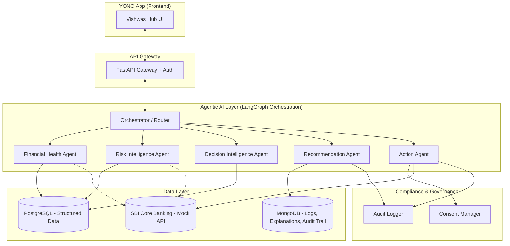
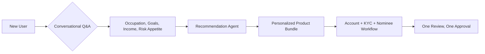
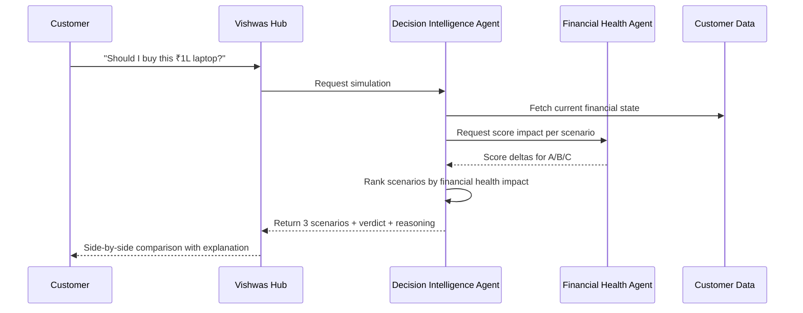
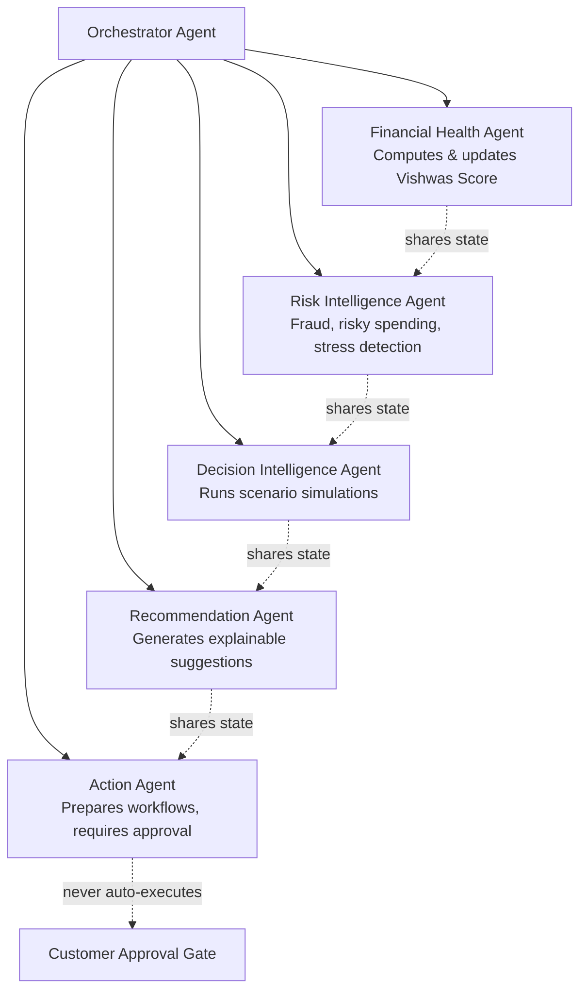
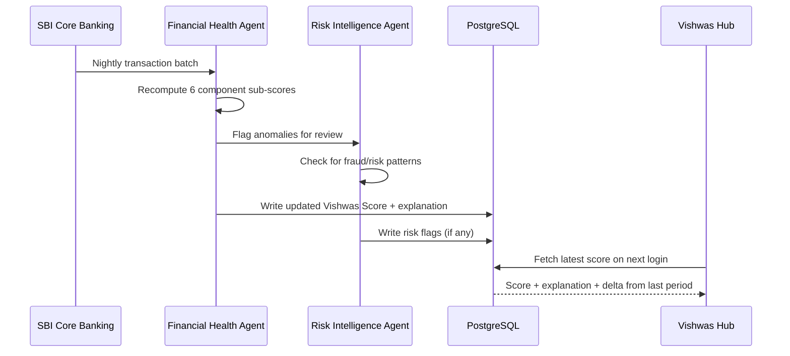
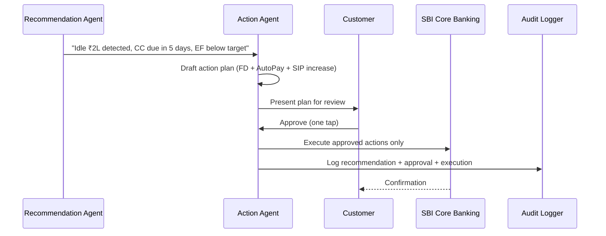
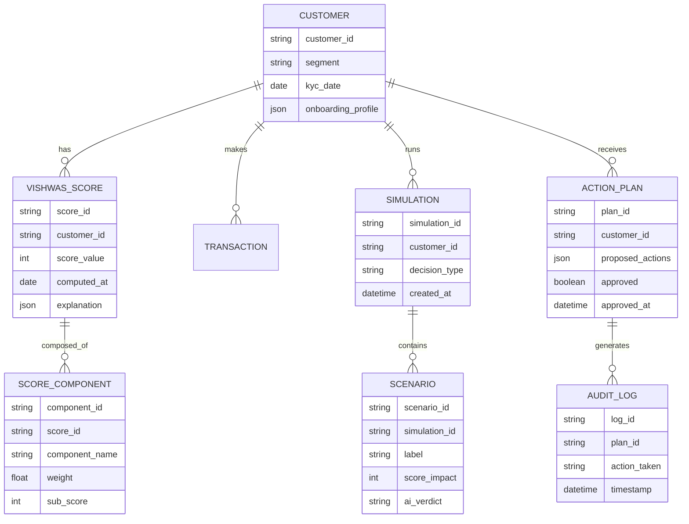

# SBI Vishwas
### AI-Powered Financial Well-being Platform for YONO

> **"Banking that Understands, Guides and Protects."**

Built for **SBI Hackathon @ Global Fintech Fest 2026** — Theme: *Agentic AI for Customer Acquisition, Digital Adoption & Digital Engagement*

---

## Table of Contents

1. [Problem Statement](#1-problem-statement)
2. [Solution Overview](#2-solution-overview)
3. [System Architecture](#3-system-architecture)
4. [Core Modules](#4-core-modules)
5. [Vishwas Score — Detailed Formula](#5-vishwas-score--detailed-formula)
6. [Future Decision Simulator](#6-future-decision-simulator)
7. [Multi-Agent Architecture (Agentic AI Layer)](#7-multi-agent-architecture-agentic-ai-layer)
8. [Data Flow & Sequence Diagrams](#8-data-flow--sequence-diagrams)
9. [Database Schema (Conceptual)](#9-database-schema-conceptual)
10. [Tech Stack](#10-tech-stack)
11. [Compliance & Trust Framework](#11-compliance--trust-framework)
12. [Competitive Differentiation](#12-competitive-differentiation)
13. [Business Impact](#13-business-impact)
14. [Roadmap](#14-roadmap)
15. [Team](#15-team)

---

## 1. Problem Statement

Modern digital banking apps (including YONO) excel at **transaction processing** — payments, transfers, bill pay, account opening. But they remain reactive. Customers are left to answer high-stakes financial questions entirely on their own:

- Can I afford this purchase right now?
- Should I break my FD or take a loan instead?
- Why do I never seem to save anything?
- Which SBI product actually benefits *me*, specifically?
- What should I do next with my money?

Banks today answer **"What happened?"**
AI assistants today answer **"What do you want to know?"**

**Nobody is answering: "What should I do next, why, and what happens if I do it?"**

That gap — between transaction processing and financial decision intelligence — is what SBI Vishwas closes.

---

## 2. Solution Overview

SBI Vishwas is an **Agentic AI layer embedded inside YONO**, not a separate app. It runs a continuous cycle for every customer:

```
MEASURE  →  EXPLAIN  →  SIMULATE  →  RECOMMEND  →  ACT
   ↑                                                  │
   └──────────────────────────────────────────────────┘
```

| Stage | What Happens |
|---|---|
| **Measure** | Continuously compute the customer's Vishwas Score from existing SBI data |
| **Explain** | Tell the customer *why* the score moved, in plain language |
| **Simulate** | Let the customer test financial decisions before making them |
| **Recommend** | Surface personalized, explainable next actions |
| **Act** | Prepare the banking workflow — customer approves with one tap |

Critically: **the AI never executes a financial action without explicit customer consent.** It prepares; the customer decides.

---

## 3. System Architecture



**Design principle:** Every agent reads from SBI's existing data (via mock APIs for the prototype). No external data sources — no emails, SMS, contacts, social media. This keeps the system compliant and trustworthy by construction, not by policy alone.

---

## 4. Core Modules

### 4.1 Vishwas Discover (Pre-Customer / Onboarding)

Conversational onboarding that replaces a 50-product catalogue with a personalized starter journey.



### 4.2 Vishwas Score (Existing Customers)

A continuously updated 0–100 financial well-being score. See [Section 5](#5-vishwas-score--detailed-formula) for full formula.

### 4.3 Explainable AI Layer

Every score change and every recommendation ships with a plain-language "why," the contributing factors, and the AI's confidence level. No black-box outputs.

### 4.4 Future Decision Simulator (Flagship Feature)

See [Section 6](#6-future-decision-simulator).

### 4.5 Vishwas Action Center

Detects opportunities → drafts an action plan → customer approves in one tap → workflow executes via SBI's core banking APIs.

---

## 5. Vishwas Score — Detailed Formula

The score is a weighted composite across six financial dimensions, each normalized to a 0–100 sub-score before weighting.

| Component | Weight | SBI Data Source | What It Captures |
|---|---:|---|---|
| Savings & Liquidity | 25% | Avg monthly balance, FD holdings, savings account inflow/outflow | Can the customer absorb a shock? |
| Debt & Credit Utilization | 20% | Credit card outstanding ÷ limit, total debt ÷ income | Is debt under control? |
| Repayment Behaviour | 20% | Loan EMI history, bounce/default records | Is the customer reliable on commitments? |
| Spending Discipline | 15% | UPI/debit transaction categorization, discretionary vs essential ratio | Is spending sustainable? |
| Emergency Fund Adequacy | 10% | Liquid savings ÷ average 3-month expenses | Is there a safety buffer? |
| Investment Diversification | 10% | Mutual funds, SIPs, insurance, FD spread | Is wealth being built, not just held? |

**Formula:**

```
VishwasScore = Σ (ComponentScore_i × Weight_i)   for i = 1 to 6

where each ComponentScore_i is normalized to a 0–100 scale using
min-max normalization against population-level benchmarks for that
customer segment (student / salaried / self-employed / retiree).
```

**Why segment-based normalization matters:** A student's "good" savings rate looks nothing like a salaried professional's. Scoring everyone against the same absolute benchmark would unfairly penalize early-career or lower-income customers — defeating the financial inclusion goal of the hackathon theme.

### Cold Start Handling

New customers have no transaction history. Rather than withhold a score, Vishwas generates an **Initial Vishwas Score (Estimated)** using KYC-stage data SBI already collects: occupation, income bracket, age, and stated financial goals. This is explicitly labeled as an estimate, with a note: *"Your score will become more personalized as you bank with us."*

This is actually a structural advantage over fintech competitors — SBI's KYC process already captures more onboarding data than most neobanks ever get from a new signup.

---

## 6. Future Decision Simulator

The signature feature. Before any major financial decision, the customer can simulate multiple paths and see projected outcomes side by side — **before** committing.

**Example: ₹1,00,000 laptop purchase**

| | Scenario A: Pay in Full | Scenario B: 6-Month EMI | Scenario C: Delay to Next Salary |
|---|---|---|---|
| Vishwas Score Impact | −12 points | −4 points | 0 points |
| Emergency Fund | Drops below target | Minor dip | Unaffected |
| Goal Timeline | Delayed 2 months | On track | On track |
| Liquidity | Critical | Moderate | Healthy |
| **AI Verdict** | ⚠️ Risky | ✅ Recommended | ✅ Best, if time permits |

**Scope beyond purchases** — the simulator generalizes to any major decision:

- Taking a loan vs. waiting
- Breaking an FD vs. taking an overdraft
- Starting/increasing a SIP
- Prepaying a loan vs. investing the surplus
- Upgrading insurance coverage



---

## 7. Multi-Agent Architecture (Agentic AI Layer)

SBI Vishwas is deliberately **not** a single chatbot. It's a coordinated system of specialized agents, orchestrated via LangGraph, which directly aligns with the hackathon's Agentic AI framing.



| Agent | Responsibility | Never Does |
|---|---|---|
| **Financial Health Agent** | Calculates and continuously updates the Vishwas Score | Make subjective judgments without data backing |
| **Risk Intelligence Agent** | Detects fraud, duplicate subscriptions, risky spending, unusual withdrawals | Block transactions unilaterally |
| **Decision Intelligence Agent** | Runs "what-if" simulations across financial scenarios | Recommend without showing alternatives |
| **Recommendation Agent** | Generates personalized, explainable suggestions | Push products that don't fit the customer's profile |
| **Action Agent** | Prepares banking workflows (FD creation, SIP setup, AutoPay) | Execute any action without explicit one-tap approval |

---

## 8. Data Flow & Sequence Diagrams

### 8.1 Daily Score Update Cycle



### 8.2 Action Center Approval Flow



---

## 9. Database Schema (Conceptual)



---

## 10. Tech Stack

| Layer | Technology | Why |
|---|---|---|
| Frontend | React / Next.js | Embeds as a module within YONO's existing shell |
| Backend API | FastAPI (Python) | Fast, async, plays well with AI/ML pipelines |
| Agent Orchestration | LangGraph | Stateful multi-agent workflows with explicit control flow |
| Database (structured) | PostgreSQL | Transactional integrity for financial data |
| Database (logs/explanations) | MongoDB | Flexible schema for AI reasoning traces & audit logs |
| AI/Reasoning Layer | LLM + Rule Engine hybrid | LLM for explanation generation, deterministic rules for score math (auditability) |
| Banking Integration | Mock SBI APIs (prototype) | Real APIs unavailable pre-partnership; mock layer mirrors expected SBI core banking contracts |

**Why a hybrid rule engine + LLM, not pure LLM:** Financial scores need to be deterministic and auditable for regulatory reasons. The LLM's job is to *explain* the math in plain language — not to *compute* the score itself. This is a deliberate design choice that should be called out explicitly to the jury, since it preempts the "can you trust an LLM with my finances" objection.

---

## 11. Compliance & Trust Framework

| Requirement | How Vishwas Addresses It |
|---|---|
| **DPDP Act, 2023** | Explicit consent collected before any data use; purpose limitation enforced — data used only for the stated well-being feature, nothing else |
| **RBI's Draft Framework on Responsible & Ethical AI (FREE-AI)** | Mandatory human-in-the-loop for every financial action; no autonomous execution |
| **Data Localisation** | All customer data remains within SBI's existing infrastructure; no third-party data egress |
| **Not a Credit Score** | Vishwas Score is explicitly a well-being indicator, not a creditworthiness score — avoids overlap with CIBIL/CIC-regulated territory |
| **Auditability** | Every recommendation, simulation, and approved action is logged with full reasoning trace |
| **Customer Control** | Zero financial action executes without one-tap, explicit customer approval |

---

## 12. Competitive Differentiation

| | Fintech Wellness Apps (Fi, Jupiter, etc.) | SBI Vishwas |
|---|---|---|
| Data depth | Limited, often self-reported or aggregated via account linking | Native SBI transaction history, decades deep |
| Trust level | Neobank-level trust | Backed by India's largest, most trusted public sector bank |
| Action capability | Suggests, redirects elsewhere | Prepares and executes within SBI's own ecosystem |
| Outlook | Reports what happened | Simulates what will happen, before it happens |
| Reach | Urban, digitally-native segment | SBI's 500M+ customer base, including underserved segments |

**The core positioning line:** *Others analyze. SBI Vishwas understands, reasons, simulates, and acts — with your approval.*

---

## 13. Business Impact

| For SBI | For the Customer |
|---|---|
| Personalized onboarding → higher acquisition conversion | Clear, jargon-free understanding of financial health |
| Vishwas Hub gives daily reason to open YONO → engagement | Confidence before big financial decisions |
| Contextual nudges → higher FD/SIP/insurance product uptake | Reduced financial stress and anxiety |
| Early detection of financially stressed customers → proactive retention | One-tap execution of complex financial actions |
| Differentiated digital offering vs. private banks and neobanks | A bank that actively works in their interest, not just processes requests |

---

## 14. Roadmap

| Phase | Scope |
|---|---|
| **Round 1 (Idea Submission)** | Concept validation, UI mockups, architecture documentation (this README) |
| **Round 2 (Prototype, 30 days)** | Working demo: mock-API-backed score engine, simulator UI, action center flow |
| **Post-Hackathon (if selected)** | Integration with SBI sandbox APIs, pilot with a customer segment, regulatory sign-off |

---

## 15. Team

| Name | Role | Organization |
|---|---|---|
| Nishant | [Your role — e.g. Product & AI Architecture] | Manipal University Jaipur |

---

### Closing Note

SBI Vishwas isn't pitched as a chatbot bolted onto YONO. It's positioned as a **financial intelligence layer** — the continuous measure → explain → simulate → recommend → act loop is the actual innovation, not any single feature. Every design decision in this document, from the hybrid rule-engine/LLM split to the segment-based score normalization, was made to survive a real SBI technical and compliance review, not just to look good on a slide.
